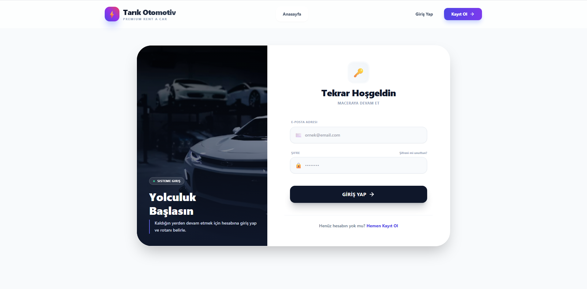
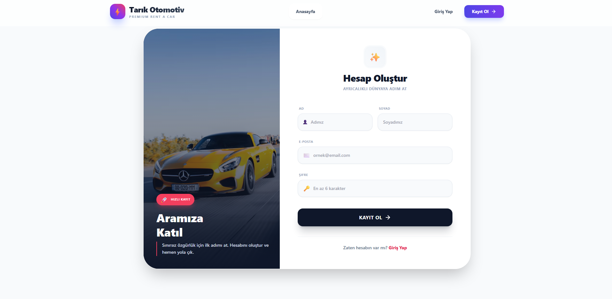
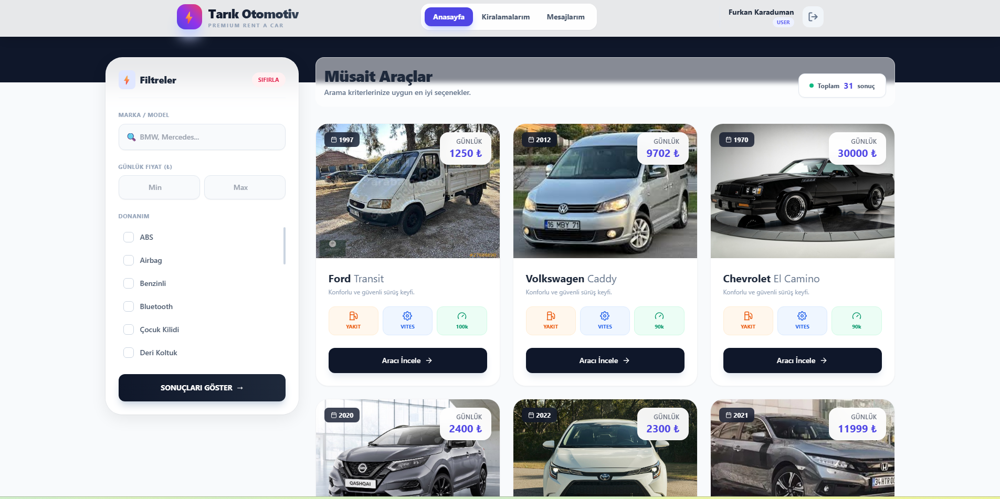
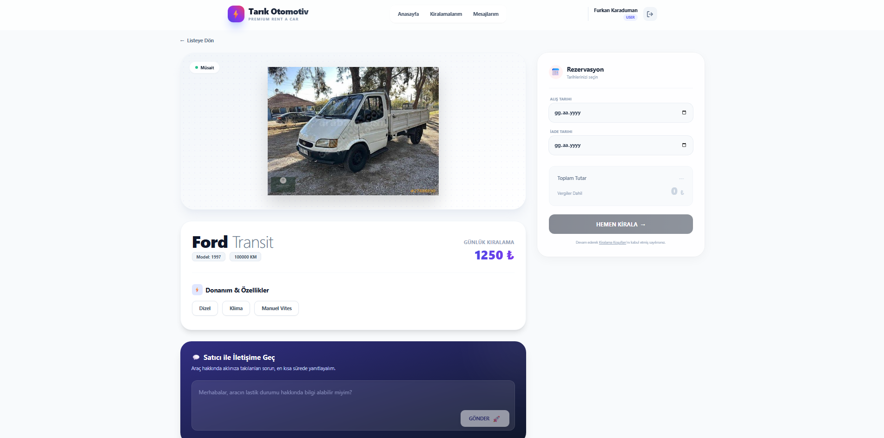
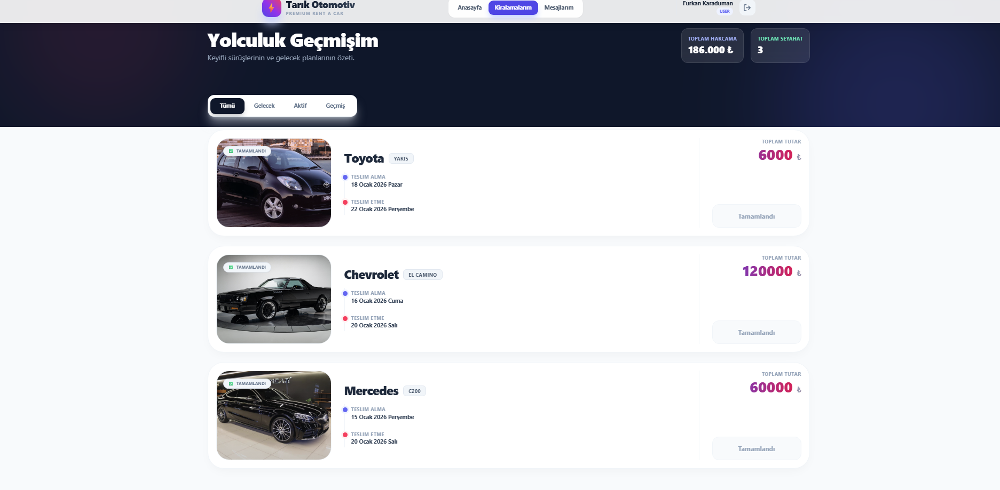
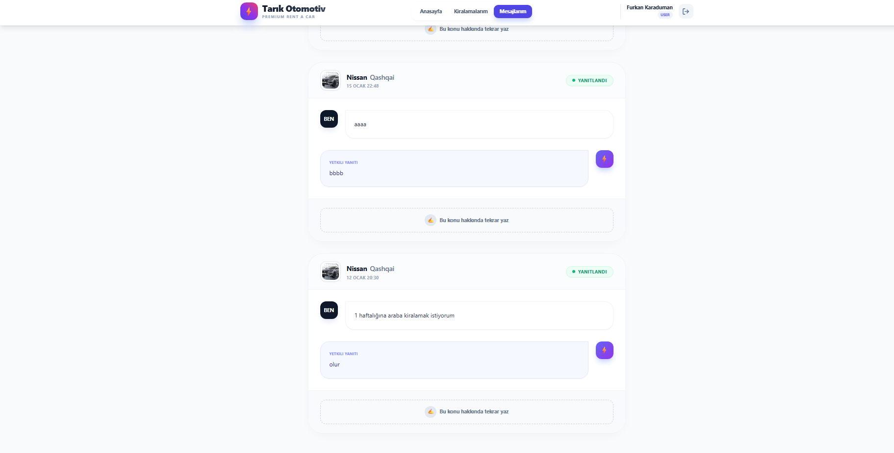
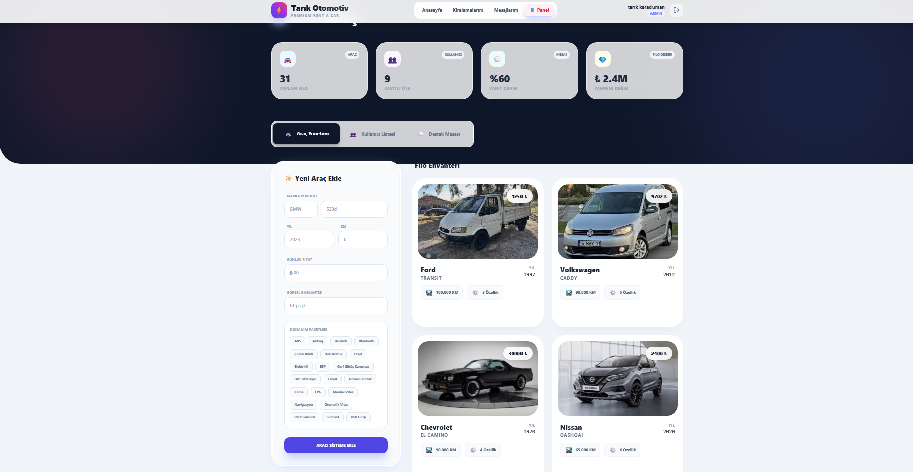
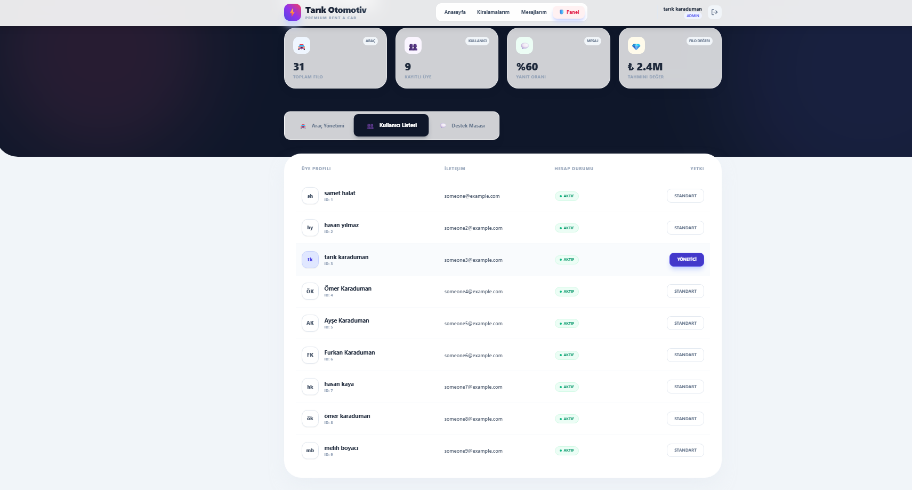
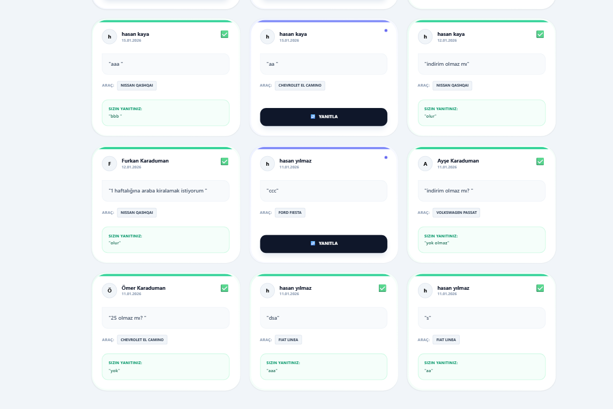

# CarRentLine - Araç Kiralama Sistemi 🚗

CarRentLine, kullanıcıların araçları inceleyip kiralayabildiği, yöneticilerin ise araçları ve rezervasyonları yönetebildiği, modern web teknolojileri kullanılarak geliştirilmiş tam kapsamlı (Full-Stack) bir araç kiralama platformudur.

Bu proje, **Bilgisayar Mühendisliği** eğitimi kapsamında geliştirilmiş olup, temiz mimari (Clean Architecture), güvenlik standartları ve modern yazılım geliştirme prensiplerini (SOLID, DRY) hedefler.

## 🛠 Teknolojiler ve Mimari

Proje,Backend ve Frontend olmak üzere iki ana parçadan oluşur.

### 🔙 Backend (Sunucu Tarafı)
Backend tarafında  **NestJS** framework'ü tercih edilmiştir.

* **Framework:** NestJS (Node.js)
* **Dil:** TypeScript
* **Veritabanı:** Microsoft SQL Server (MSSQL)
* **ORM:** Prisma ORM (Veritabanı modelleme ve migrasyonlar için)
* **Kimlik Doğrulama:** JWT (JSON Web Token) & Passport.js
* **API Dokümantasyonu:** Swagger (OpenAPI)
* **Validasyon:** class-validator & class-transformer

### 🎨 Frontend (İstemci Tarafı)
Kullanıcı arayüzü için **React** kütüphanesi ve modern CSS araçları kullanılmıştır.

* **Kütüphane:** React.js
* **Styling:** Tailwind CSS
* **Routing:** React Router DOM
* **HTTP İstekleri:** Axios (Interceptor yapısı ile token yönetimi)
* **State Yönetimi:** Context API (AuthContext)

## 📋 Özellikler

### Kullanıcı Paneli
* 🔐 **Kayıt ve Giriş:** Kullanıcılar sisteme güvenli bir şekilde kayıt olabilir ve giriş yapabilir.
* 🚙 **Araç Listeleme:** Mevcut araçları marka, model ve özelliklerine göre görüntüleme.
* 📅 **Rezervasyon:** Seçilen tarihler arasında araç kiralama (Çakışma kontrolü ile).
* 💬 **Mesajlaşma:** Araçlar hakkında admin ile mesajlaşma ve gelen cevapları görüntüleme.
* 👤 **Profil Yönetimi:** Geçmiş rezervasyonları ve mesajları görüntüleme.

### Admin Paneli
* 🛠 **Araç Yönetimi:** Yeni araç ekleme, güncelleme, silme ve özellik (klima, GPS vb.) atama.
* ✅ **Kullanıcı Görüntüleme ve Yetkilendirme:**Sistemdeki tüm kullanıcıları görüntüleyebilme ve yetkilendirebilme(admin,kullanıcı).
* 📩 **İletişim:** Kullanıcı mesajlarını görüntüleme ve cevaplama.

## 🗄️ Veritabanı Tabloları

Projenin veritabanı tablosu ve özellikleri aşağıdaki gibidir:

* **User:** Kullanıcı bilgileri ve rolleri (Admin/User).
* **Car:** Araç detayları, günlük fiyatı, görseli ve durumu.
* **Reservation:** Kullanıcı ve Araç arasındaki kiralama işlemi (Başlangıç/Bitiş tarihi).
* **Message:** Kullanıcı ve Admin arasındaki soru-cevap trafiği.
* **Feature:** Araçlara ait dinamik özellikler (Otomatik vites, Dizel vb.).

## 🚀 Kurulum ve Çalıştırma

Projeyi yerel makinenizde çalıştırmak için aşağıdaki adımları izleyin.

### Ön Gereksinimler
* Node.js (v18 veya üzeri)
* SQL Server (Yerel veya Docker üzerinde çalışan bir instance)

### 1. Projeyi Klonlayın

```bash
git clone [https://github.com/kullaniciadi/CarRentLine.git](https://github.com/kullaniciadi/CarRentLine.git)
cd CarRentLine
```

## 2. Backend Kurulumu

### Gereksinimler
- Node.js (önerilen: LTS sürüm)
- npm

### Kurulum Adımları

```bash
cd backend
npm install
```
### Çevresel Değişkenler (.env)

`backend` klasörü içinde bir `.env` dosyası oluşturun ve aşağıdaki ayarları kendi sisteminize göre düzenleyin:

```env
DATABASE_URL="sqlserver://localhost:1433;database=CarRentLineDB;user=SA;password=Sifreniz123;encrypt=true;trustServerCertificate=true"
JWT_SECRET="gizli_anahtariniz"
```

### Veritabanı Migrasyonu

Tabloları veritabanında oluşturmak için aşağıdaki komutu çalıştırın:
```bash
 
npx prisma migrate dev --name init
```
### Sunucuyu Başlatma

Backend sunucusunu başlatmak için:
 ```bash
npm run start:dev
```

## 3. Frontend Kurulumu

Yeni bir terminal açın ve `frontend` klasörüne geçin, ardından bağımlılıkları yükleyin:

```bash
cd frontend
npm install
```
### Uygulamayı Başlatma

Frontend uygulamasını başlatmak için:
```bash
npm start
```
## 📷 Ekran Görüntüleri

### 🔐 Giriş & Kayıt

**Giriş Sayfası**


**Kayıt Ol Sayfası**


---

### 🚗 Kullanıcı Paneli

**Araç Görüntüleme ve Listeleme**


**Araç Kiralama**


**Kullanıcının Yapmış Olduğu Kiralamalar**


**Kullanıcının Yapmış Olduğu Mesajlaşmalar**


---

### 🛠️ Admin Paneli

**Araç Listeleme, Ekleme, Güncelleme ve Silme**


**Kullanıcı Görüntüleme ve Yetkilendirme**


**Kullanıcı Mesajlarına Cevap Verme**



